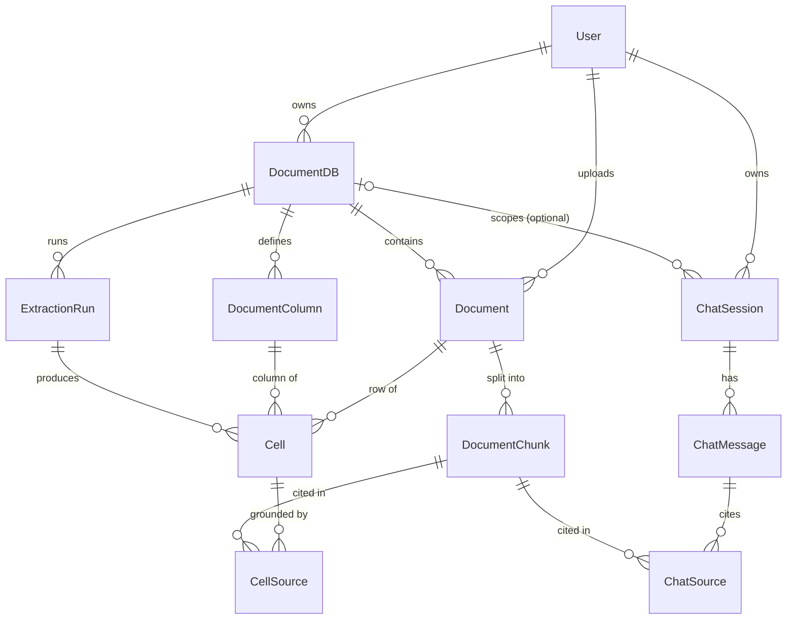

# Kalex — 도메인 모델 · 테이블 · API 설계 (v0.1)

> 화면기획([screen-plan.md](screen-plan.md))에서 도출한 제품 개념을 **도메인 모델 →
> 테이블 → API**로 형식화한 문서. 백엔드는 DDD(바운디드 컨텍스트 + ports/adapters)를
> 따른다([backend/CLAUDE.md](../backend/CLAUDE.md)). 이 문서는 "무엇을(모델)"을 정의하고,
> 구현 시 각 컨텍스트의 `domain` 레이어가 이 정의를 단일 진실원본으로 삼는다.
>
> 상태: **설계 초안.** 8장(사용자 스케치 매핑)·9장(오픈 퀘스천)에 결정 포인트를 모아둠.

---

## 0. 한눈에 보기

Kalex의 데이터 모델은 **하나의 행렬(matrix)** 로 수렴한다.

```text
              컬럼(MFN)     컬럼(계약기간)    컬럼(준거법)    …   ← DocumentDB가 소유하는 DocumentColumn(추출 스키마)
Document(A)  ┌───────────┬───────────────┬───────────────┐
Document(B)  │   Cell    │     Cell      │     Cell      │   ← Cell = (Document × DocumentColumn) 추출 결과
Document(C)  │  +source  │   +source     │   +source     │
   ↑         └───────────┴───────────────┴───────────────┘
DocumentDB의 문서(행)
```

- **DocumentDB** = 도메인 = 문서종류(평면 IA). 컬럼(추출 스키마)과 문서를 함께 소유한다.
- **DocumentColumn** = 그리드의 열 정의("무엇을 뽑을지"의 프롬프트/타입). DB 레벨에 한 번 정의되어 모든 문서에 공통 적용.
- **Document** = 업로드된 원본 파일 → Markdown 변환 → 청크로 분해.
- **DocumentChunk** = 검색·인용 grounding의 최소 단위(텍스트 + 페이지/오프셋 + 임베딩).
- **Cell** = (Document × DocumentColumn) 교차점의 추출값 + 신뢰도 + 인용. 사람이 검증/수정하는 대상.
- **ChatSession / ChatMessage** = 전체(또는 특정) DB에 대한 대화. 답변은 청크를 인용.
- **User** = 소유/감사 주체. (인증 화면은 범위 외지만 모델에는 둔다.)

> 핵심 결정: **추출(Cell)과 챗(Message)은 동일한 `DocumentChunk`를 인용한다.**
> "셀의 근거 보기"와 "챗 답변의 출처 보기"가 같은 grounding 메커니즘을 공유한다.

---

## 1. 바운디드 컨텍스트 (DDD)

기존 백엔드에는 일반(generic) 인프라 컨텍스트 두 개가 있다: `document_conversion`(Docling),
`llm`(vLLM). 여기에 도메인 컨텍스트를 추가한다.

| 컨텍스트 | 책임 | 핵심 엔티티 | 의존(upstream) |
|---|---|---|---|
| `identity` | 사용자·소유권 | User | — |
| `document_db` | 워크스페이스 + 추출 스키마 | DocumentDB, DocumentColumn | identity |
| `ingestion` | 원본→Markdown→청크→임베딩 적재 | Document, DocumentChunk | document_db, `document_conversion`, `embedding`(인프라) |
| `extraction` | 셀 단위 추출 실행 + 검증 | Cell, CellSource, ExtractionRun | document_db(컬럼), ingestion(검색), `llm` |
| `chat` | 대화 + RAG 검색 | ChatSession, ChatMessage, ChatSource | ingestion(검색), `llm` |
| `document_conversion` *(기존)* | Docling 변환 | — (무상태) | — |
| `llm` *(기존)* | vLLM 프록시 | — (무상태) | — |
| `embedding` *(신규 인프라)* | **BGE-M3** 임베딩 + **BGE-Reranker-V2-M3** 재정렬 | — (무상태) | — |

```text
                 ┌────────────┐
                 │  identity  │
                 └─────┬──────┘
                       ▼
                ┌──────────────┐        ┌──────────────────────┐
                │ document_db  │        │ document_conversion   │ (generic infra)
                │ (DB+컬럼정의) │        └───────────┬──────────┘
                └──────┬───────┘                    ▼
                       ▼                    ┌────────────────┐
                ┌──────────────┐  chunks    │   ingestion    │
                │  extraction  │◀───────────│ (Doc + Chunk)  │
                │  (Cell)      │            └───────┬────────┘
                └──────┬───────┘                    │ chunks
                       │                            ▼
                       │                    ┌────────────────┐
                       └───────── llm ──────│      chat      │
                          (vLLM infra)      │ (Session/Msg)  │
                                            └────────────────┘
```

규칙(backend/CLAUDE.md): 컨텍스트 간 협력은 **포트(ABC)** 로 추상화하고, 조립은 `app/main.py`
에서만. 예: `extraction`은 `ChunkReadPort`(ingestion 제공)와 `LlmPort`(llm 제공)에 의존하되
구현체를 직접 import 하지 않는다.

---

## 2. 엔티티 정의

식별자는 모두 **UUID v4**(프론트 `crypto.randomUUID`와 정합). 모든 테이블에 `created_at`,
`updated_at`(타임스탬프). 시간은 UTC, ISO 8601로 직렬화.

### 2.1 User  *(identity)*

소유·감사 주체. 인증/권한 라우팅 화면은 v0.1 범위 밖이지만, 모든 자원의 `created_by`를
위해 엔티티는 둔다.

| 필드 | 타입 | 비고 |
|---|---|---|
| `id` | uuid (PK) | |
| `email` | text unique | K&C 계정 |
| `name` | text | 표시명 |
| `role` | enum(`admin`,`user`) | admin=스키마/문서 관리, user=챗·읽기. 라우팅은 후속. |
| `created_at` / `updated_at` | timestamptz | |

### 2.2 DocumentDB  *(document_db)*

도메인 = 문서종류(예: 계약서·약관·소송서면). 컬럼 스키마와 문서의 컨테이너.

| 필드 | 타입 | 비고 |
|---|---|---|
| `id` | uuid (PK) | |
| `name` | text | "계약서" 등 |
| `description` | text null | |
| `created_by` | uuid → User | |
| `created_at` / `updated_at` | timestamptz | |

> 프론트가 보여주는 `documentCount`/`columnCount`/`updatedAt`는 저장 컬럼이 아니라
> **조회 시 집계**(또는 read model). 쓰기 시 비정규화 카운트를 두는 건 후속 최적화.

### 2.3 DocumentColumn  *(document_db)*

그리드의 열 = 추출 스키마 항목. DB 레벨에 정의되어 그 DB의 모든 문서에 공통 적용.
프론트 `document-review/model/types.ts`의 `Column`을 형식화(서버 엔티티명은 `DocumentColumn`).

| 필드 | 타입 | 비고 |
|---|---|---|
| `id` | uuid (PK) | |
| `document_db_id` | uuid → DocumentDB (FK, cascade) | |
| `name` | text | 열 제목 |
| `data_type` | enum(`text`,`number`,`date`,`boolean`,`list`,`single_select`,`multi_select`) | 프론트 5종 + 법률 분류용 select 2종 |
| `prompt` | text | LLM 추출 지시문("MFN 조항 존재 여부와 범위") |
| `options` | jsonb null | select 계열의 선택지 |
| `position` | int | 열 순서 |
| `created_at` / `updated_at` | timestamptz | |

> 프론트 `Column.status`(idle/extracting/…)는 **컬럼 자체 상태가 아니라** "이 컬럼의 셀들이 추출 중인가"의
> UI 파생값 → 서버 `DocumentColumn`은 status를 저장하지 않고 셀/런 상태에서 계산한다.

### 2.4 Document  *(ingestion)*

업로드된 원본 1건. 변환 결과(Markdown)와 변환 상태를 갖는다.

| 필드 | 타입 | 비고 |
|---|---|---|
| `id` | uuid (PK) | |
| `document_db_id` | uuid → DocumentDB (FK, cascade) | |
| `name` | text | 파일명/표시명 |
| `mime_type` | text | application/pdf 등 |
| `size_bytes` | bigint | |
| `storage_uri` | text | 원본 파일 위치(객체 스토리지 경로). **base64를 DB/프론트에 싣지 않는다.** |
| `page_count` | int null | |
| `markdown` | text null | Docling 변환 결과(전문 검색·뷰어용) |
| `status` | enum — §3.1 | uploaded→converting→chunking→ready/failed |
| `error` | text null | 실패 사유 |
| `created_by` | uuid → User | |
| `created_at` / `updated_at` | timestamptz | |

### 2.5 DocumentChunk  *(ingestion)*

검색·인용의 최소 단위. 추출 grounding과 챗 RAG가 **공유**한다.

| 필드 | 타입 | 비고 |
|---|---|---|
| `id` | uuid (PK) | |
| `document_id` | uuid → Document (FK, cascade) | |
| `index` | int | 문서 내 청크 순번 |
| `text` | text | 청크 본문 |
| `page` | int null | 시작 페이지(인용 점프용) |
| `char_start` / `char_end` | int null | Markdown 내 오프셋(하이라이트용) |
| `bbox` | jsonb null | PDF 좌표(선택, 뷰어 하이라이트 고도화용) |
| `embedding` | vector(1024) null | 임베딩(pgvector). **BGE-M3** → 1024차원. |
| `created_at` | timestamptz | |

> 인덱스: `ivfflat`/`hnsw` on `embedding`(코사인). `document_id`/DB 스코프로 필터 후 검색.
> 검색은 2단계: **BGE-M3 벡터 검색(top-k)** → **BGE-Reranker-V2-M3 재정렬(top-n)**. 자세한 파이프라인은 §2.12.

### 2.6 Cell  *(extraction)*

(Document × DocumentColumn) 교차점의 추출 결과. 사람이 검증/수정하는 대상. 프론트
`ExtractionCell`을 형식화하되, 추출 상태와 검증 상태를 **분리**한다.

| 필드 | 타입 | 비고 |
|---|---|---|
| `id` | uuid (PK) | |
| `document_id` | uuid → Document (FK, cascade) | |
| `column_id` | uuid → DocumentColumn (FK, cascade) | |
| `value` | text null | 추출 표시값 |
| `value_json` | jsonb null | 타입별 정규화값(number/date/list) |
| `confidence` | enum(`high`,`medium`,`low`) null | 모델 신뢰도 |
| `reasoning` | text null | 모델 근거 설명 |
| `extraction_method` | enum(`full_context`,`retrieval_fallback`) null | 전체 문서 컨텍스트로 뽑았는지, 초장문이라 검색 폴백으로 뽑았는지(§2.12). **UI에서 구분 표기** |
| `extraction_status` | enum — §3.2 | idle/queued/running/done/error |
| `review_status` | enum(`unreviewed`,`verified`,`edited`,`rejected`) | 사람 검증 워크플로 |
| `last_run_id` | uuid → ExtractionRun null | 마지막 추출 런 |
| `created_at` / `updated_at` | timestamptz | |
| | | **uniq(`document_id`,`column_id`)** — 교차점당 1셀 |

### 2.7 CellSource  *(extraction)*

셀의 근거. 청크를 가리키고, 표시용 인용문/페이지를 캐시한다.

| 필드 | 타입 | 비고 |
|---|---|---|
| `id` | uuid (PK) | |
| `cell_id` | uuid → Cell (FK, cascade) | |
| `chunk_id` | uuid → DocumentChunk null | grounding 대상(청크 삭제 시 null) |
| `quote` | text | 인용 스니펫(표시·하이라이트) |
| `page` | int null | |
| `char_start` / `char_end` | int null | |
| `created_at` | timestamptz | |

### 2.8 ExtractionRun  *(extraction)*

"Run" 버튼 1회 = 일괄 추출 작업. 진행률·재실행·감사용. (셀 단위 비동기 처리의 집계)

| 필드 | 타입 | 비고 |
|---|---|---|
| `id` | uuid (PK) | |
| `document_db_id` | uuid → DocumentDB (FK) | |
| `scope` | jsonb | 대상 범위(전체 / 특정 document_ids / column_ids) + `overwriteReviewed`(기본 false) |
| `model` | text | 사용 모델명 |
| `status` | enum(`queued`,`running`,`completed`,`failed`,`canceled`) | |
| `total` / `done` / `failed` | int | 진행률 |
| `created_by` | uuid → User | |
| `created_at` / `updated_at` | timestamptz | |

### 2.9 ChatSession  *(chat)*

대화 1건. 기본 **전역**(모든 DB) 검색이며, 선택적으로 특정 DB로 스코프 가능.
프론트 `chatSessionSchema`(localStorage)를 서버 영속으로 승격.

| 필드 | 타입 | 비고 |
|---|---|---|
| `id` | uuid (PK) | |
| `title` | text | 첫 메시지로 자동 생성 |
| `scope_document_db_id` | uuid → DocumentDB null | null=전역, 값=해당 DB로 한정 |
| `created_by` | uuid → User | |
| `created_at` / `updated_at` | timestamptz | |

### 2.10 ChatMessage  *(chat)*

세션 내 메시지. assistant 메시지는 출처(ChatSource)를 갖는다. (사용자 스케치의 `Chat`)

| 필드 | 타입 | 비고 |
|---|---|---|
| `id` | uuid (PK) | |
| `session_id` | uuid → ChatSession (FK, cascade) | |
| `role` | enum(`user`,`assistant`) | 프론트는 `model`을 쓰는데 표준 `assistant`로 통일(어댑터에서 매핑) |
| `content` | text | |
| `created_at` | timestamptz | (프론트 `timestamp` 대응) |

### 2.11 ChatSource  *(chat)*

챗 답변의 출처. 셀 출처(CellSource)와 동일 패턴으로 청크를 가리킨다. 프론트의 기존
`ChatSource`(documentDb/documentName/page/quote)와 이름이 일치 — documentDb/documentName 같은
표시 메타는 저장하지 않고 조인/캐시로 채운다.

| 필드 | 타입 | 비고 |
|---|---|---|
| `id` | uuid (PK) | |
| `message_id` | uuid → ChatMessage (FK, cascade) | |
| `chunk_id` | uuid → DocumentChunk null | |
| `quote` | text | |
| `page` | int null | |
| `rank` | int | 출처 표시 순번(①②③) |
| `created_at` | timestamptz | |

### 2.12 추출(extraction) 전략 & 검색 파이프라인

> **원칙: 추출은 임베딩 검색에 의존하지 않는다.** 문서 1건의 셀 추출은 검색 미스로
> 정답 구간을 놓치면 그대로 오답이 된다. 따라서 **문서 전체 컨텍스트를 LLM에 주는 것**이
> 기본이고, 임베딩 검색은 (1) 컨텍스트 한도를 넘는 초장문 폴백, (2) 출처 링크, (3) 챗(RAG)
> 에만 쓴다.

#### 추출 경로 (셀 채우기)

```text
                          ┌─ 문서 토큰 ≤ 예산 ─▶ [A] 전체 markdown 컨텍스트 ─┐
컬럼(label+prompt) 세트 ──┤                                                 ├─▶ Gemini/GLM
   (문서당 배치)          └─ 문서 토큰 > 예산 ─▶ [B] 임베딩 검색으로 관련 ──┘   (구조화 출력)
                                                  청크만 모아 컨텍스트 구성        │
                                                  (retrieval_fallback)            ▼
                                          value · confidence · quote · reasoning · (컬럼별)
                                                  → Cell(+CellSource) 적재
```

- **[A] 기본 = 전체 문서 컨텍스트.** `Document.markdown` 전체 + (스코프 내) 컬럼들의
  label/prompt를 한 번에 보내 **문서당 1회 호출로 여러 컬럼을 동시 추출**(효율). 단일 컬럼
  재추출/컬럼 추가 시에는 해당 컬럼만 배치.
- **[B] 폴백 = 검색.** 문서가 모델 컨텍스트 예산을 초과할 때**만** 발동. 이때는 컬럼 프롬프트로
  임베딩 검색(아래 파이프라인)해 관련 청크만 모아 컨텍스트를 구성한다.
- **추출 방식 구분 저장**: 셀의 `extraction_method` = `full_context`(A) / `retrieval_fallback`(B).
  폴백 값은 문서 전체를 못 본 결과이므로 **신뢰도가 낮을 수 있어 UI에서 명확히 구분 표기**한다
  (예: 셀에 "부분 컨텍스트" 배지).

#### 컨텍스트 예산 (폴백 임계값)

폴백은 **활성 LLM의 컨텍스트 용량**을 기준으로 판단한다. 모델마다 다르므로 설정값으로 둔다.

| 모델 | 컨텍스트 | 비고 |
|---|---|---|
| GLM (온프렘 vLLM) | **65k 토큰** | 현재 배포 설정값 |
| Gemini 2.5 Flash (dev) | ~1M 토큰 | 사실상 대부분 문서가 [A]로 처리됨 |

- 예산 = `LLM_CONTEXT_TOKENS`(설정, 기본 GLM=65k) − `프롬프트/지시문 오버헤드` − `예약 출력 토큰`.
  예: GLM 65k − 약 4k(지시문) − 약 8k(출력) ≈ **문서 본문 예산 ~53k 토큰**. 초과 시 [B].
- 토큰 추정은 보수적으로(문자수 기반 근사 + 안전 마진). 임계값/마진은 튜닝 파라미터.

#### 검색 파이프라인 (폴백 + 챗 공용)

폴백([B])과 챗(RAG)이 공유하는 **2단계 retrieve → rerank**:

```text
질의(컬럼 프롬프트 또는 챗 메시지)
   │  ① 임베딩      BGE-M3 (dev: Gemini)
   ▼
pgvector 코사인 검색 (문서/DB 스코프 필터) ──▶ 후보 top-k (예: k=40)
   │  ② 재정렬      BGE-Reranker-V2-M3 (query–chunk 쌍 점수)
   ▼
상위 top-n ──▶ LLM 컨텍스트 + 출처(CellSource / ChatSource)
```

- **온프렘 모델 구성**: LLM = vLLM/GLM, 임베딩 = **BGE-M3**(1024d), 리랭커 = **BGE-Reranker-V2-M3**.
- 임베딩/리랭커는 `llm`과 별개 추론 엔드포인트 → 포트 `EmbeddingPort`/`RerankPort`로 추상화.
- **dev(Gemini)는 재정렬(②) 생략** — 벡터 검색 top-n을 바로 사용(폴백 자체가 드물게 발동).
  `RerankPort`는 온프렘에서만 구현(미설정 시 no-op = 벡터 순위 유지).
- **출처 링크**: [A]·[B] 모두 LLM이 돌려준 `quote`(원문 스니펫)를 청크에 매핑해 CellSource
  (chunk_id + page)로 저장 → "출처 보기" 점프. (매핑 실패 시 quote만 저장)
- k/n, 스코어 임계값, 컨텍스트 예산은 튜닝 파라미터(설정값).

---

## 3. 상태 머신

### 3.1 Document 생명주기

```text
uploaded ──▶ converting ──▶ chunking ──▶ ready
   │             │             │
   └─────────────┴─────────────┴──▶ failed (error 기록, 재시도 가능)
```
- `converting`: Docling `/convert` 호출(→ markdown).
- `chunking`: markdown 분할 + 임베딩 적재(DocumentChunk 생성).
- `ready`: 추출/챗 대상 가능.

### 3.2 Cell 추출 상태 × 검증 상태 (직교)

```text
extraction_status:  idle ──▶ queued ──▶ running ──▶ done
                                          └──────▶ error
review_status:      unreviewed ──▶ verified
                              ├──▶ edited     (사람이 값 수정)
                              └──▶ rejected   (근거 불충분)
```
- 두 축은 독립: `done` + `unreviewed`가 기본 상태. 사람이 검증 사이드바(A-4)에서 review_status 변경.
- 재추출 시 review_status 처리는 §9 결정 필요(수정값 보존 vs 초기화).

---

## 4. ERD



---

## 5. 테이블 설계 (PostgreSQL + pgvector)

> 발췌 DDL. 공통: `id uuid primary key default gen_random_uuid()`,
> `created_at/updated_at timestamptz not null default now()`. enum은 Postgres enum 또는
> text+check 중 택1(마이그레이션 유연성 위해 text+check 권장).

```sql
create extension if not exists vector;

create table app_user (
  id uuid primary key default gen_random_uuid(),
  email text not null unique,
  name  text not null,
  role  text not null default 'user' check (role in ('admin','user')),
  created_at timestamptz not null default now(),
  updated_at timestamptz not null default now()
);

create table document_db (
  id uuid primary key default gen_random_uuid(),
  name text not null,
  description text,
  created_by uuid references app_user(id),
  created_at timestamptz not null default now(),
  updated_at timestamptz not null default now()
);

create table document_column (            -- 엔티티 DocumentColumn ("column" 단독은 예약어)
  id uuid primary key default gen_random_uuid(),
  document_db_id uuid not null references document_db(id) on delete cascade,
  name text not null,
  data_type text not null check (data_type in
    ('text','number','date','boolean','list','single_select','multi_select')),
  prompt text not null,
  options jsonb,
  position int not null default 0,
  created_at timestamptz not null default now(),
  updated_at timestamptz not null default now()
);
create index on document_column (document_db_id, position);

create table document (
  id uuid primary key default gen_random_uuid(),
  document_db_id uuid not null references document_db(id) on delete cascade,
  name text not null,
  mime_type text not null,
  size_bytes bigint not null,
  storage_uri text not null,
  page_count int,
  markdown text,
  status text not null default 'uploaded' check (status in
    ('uploaded','converting','chunking','ready','failed')),
  error text,
  created_by uuid references app_user(id),
  created_at timestamptz not null default now(),
  updated_at timestamptz not null default now()
);
create index on document (document_db_id);

create table document_chunk (
  id uuid primary key default gen_random_uuid(),
  document_id uuid not null references document(id) on delete cascade,
  index int not null,
  text text not null,
  page int,
  char_start int,
  char_end int,
  bbox jsonb,
  embedding vector(1024),                 -- BGE-M3 (1024d)
  created_at timestamptz not null default now(),
  unique (document_id, index)
);
create index on document_chunk using hnsw (embedding vector_cosine_ops);

create table extraction_run (
  id uuid primary key default gen_random_uuid(),
  document_db_id uuid not null references document_db(id) on delete cascade,
  scope jsonb not null,
  model text not null,
  status text not null default 'queued' check (status in
    ('queued','running','completed','failed','canceled')),
  total int not null default 0,
  done  int not null default 0,
  failed int not null default 0,
  created_by uuid references app_user(id),
  created_at timestamptz not null default now(),
  updated_at timestamptz not null default now()
);

create table cell (
  id uuid primary key default gen_random_uuid(),
  document_id uuid not null references document(id) on delete cascade,
  column_id uuid not null references document_column(id) on delete cascade,
  value text,
  value_json jsonb,
  confidence text check (confidence in ('high','medium','low')),
  reasoning text,
  extraction_method text check (extraction_method in
    ('full_context','retrieval_fallback')),
  extraction_status text not null default 'idle' check (extraction_status in
    ('idle','queued','running','done','error')),
  review_status text not null default 'unreviewed' check (review_status in
    ('unreviewed','verified','edited','rejected')),
  last_run_id uuid references extraction_run(id),
  created_at timestamptz not null default now(),
  updated_at timestamptz not null default now(),
  unique (document_id, column_id)
);

create table cell_source (
  id uuid primary key default gen_random_uuid(),
  cell_id uuid not null references cell(id) on delete cascade,
  chunk_id uuid references document_chunk(id) on delete set null,
  quote text not null,
  page int,
  char_start int,
  char_end int,
  created_at timestamptz not null default now()
);
create index on cell_source (cell_id);

create table chat_session (
  id uuid primary key default gen_random_uuid(),
  title text not null default '새 대화',
  scope_document_db_id uuid references document_db(id) on delete set null,
  created_by uuid references app_user(id),
  created_at timestamptz not null default now(),
  updated_at timestamptz not null default now()
);

create table chat_message (
  id uuid primary key default gen_random_uuid(),
  session_id uuid not null references chat_session(id) on delete cascade,
  role text not null check (role in ('user','assistant')),
  content text not null,
  created_at timestamptz not null default now()
);
create index on chat_message (session_id, created_at);

create table chat_source (
  id uuid primary key default gen_random_uuid(),
  message_id uuid not null references chat_message(id) on delete cascade,
  chunk_id uuid references document_chunk(id) on delete set null,
  quote text not null,
  page int,
  rank int not null default 0,
  created_at timestamptz not null default now()
);
```

---

## 6. API 설계 (REST)

베이스: `/api/v1`. 명세는 백엔드(FastAPI) Pydantic 스키마로 정의하고 프론트는 Zod로 미러.
비동기 작업(추출/챗)은 **런 리소스 + SSE**로 진행 상황을 전달.

### 6.1 DocumentDB

| 메서드 | 경로 | 설명 |
|---|---|---|
| GET | `/document-dbs` | 목록(+집계 count) |
| POST | `/document-dbs` | 생성 |
| GET | `/document-dbs/{id}` | 상세 |
| PATCH | `/document-dbs/{id}` | 수정 |
| DELETE | `/document-dbs/{id}` | 삭제(cascade) |

### 6.2 DocumentColumn (DB 하위)

| 메서드 | 경로 | 설명 |
|---|---|---|
| GET | `/document-dbs/{id}/columns` | 컬럼 목록 |
| POST | `/document-dbs/{id}/columns` | 컬럼 추가 |
| PATCH | `/columns/{colId}` | 이름/프롬프트/타입 수정 |
| DELETE | `/columns/{colId}` | 삭제 |
| POST | `/document-dbs/{id}/columns:reorder` | 순서 변경(`{order:[colId…]}`) |

### 6.3 Document (DB 하위)

| 메서드 | 경로 | 설명 |
|---|---|---|
| GET | `/document-dbs/{id}/documents` | 문서 목록(+status) |
| POST | `/document-dbs/{id}/documents` | 업로드(multipart) → 변환·청킹 비동기 시작 |
| GET | `/documents/{docId}` | 상세 |
| DELETE | `/documents/{docId}` | 삭제 |
| GET | `/documents/{docId}/content` | Markdown 본문(뷰어) |
| GET | `/documents/{docId}/file` | 원본 다운로드(서명 URL 리다이렉트) |

### 6.4 Grid & 추출 (extraction)

| 메서드 | 경로 | 설명 |
|---|---|---|
| GET | `/document-dbs/{id}/grid` | 그리드 한 번에: rows(documents)×columns×cells, 페이지네이션 |
| POST | `/document-dbs/{id}/runs` | 추출 실행. body=`{scope:{documentIds?,columnIds?,overwriteReviewed?}, model}` → `{runId}`. 기본은 `edited`/`verified` 셀 스킵(§9.3) |
| GET | `/runs/{runId}` | 런 진행률(폴링) |
| GET | `/runs/{runId}/events` | **SSE** 진행 스트림(셀 done 이벤트) |
| POST | `/runs/{runId}:cancel` | 취소 |
| GET | `/cells/{cellId}` | 셀 상세(+sources) |
| PATCH | `/cells/{cellId}` | 수동 수정/검증(`{value?, reviewStatus}`) → edited/verified/rejected |

### 6.5 Chat

| 메서드 | 경로 | 설명 |
|---|---|---|
| GET | `/chat/sessions` | 세션 목록 |
| POST | `/chat/sessions` | 세션 생성(`{scopeDocumentDbId?}`) |
| GET | `/chat/sessions/{sid}` | 세션 + 메시지 |
| PATCH | `/chat/sessions/{sid}` | 제목 변경 |
| DELETE | `/chat/sessions/{sid}` | 삭제 |
| POST | `/chat/sessions/{sid}/messages` | 질문 전송 → **SSE**로 토큰 + 출처(source) 스트림 |

### 6.6 기존 인프라 (내부 전용으로 강등)
- `POST /convert` (Docling), `POST /llm/chat/completions` (vLLM) — 외부 노출 대신
  `ingestion`/`extraction`/`chat` 컨텍스트가 포트를 통해 내부 호출.

### 응답 형태 예시 (grid)
```jsonc
// GET /document-dbs/{id}/grid
{
  "columns": [{ "id": "...", "name": "MFN", "dataType": "boolean", "position": 0 }],
  "rows": [{
    "document": { "id": "...", "name": "계약서A.pdf", "status": "ready" },
    "cells": {
      "<columnId>": {
        "id": "...", "value": "있음", "confidence": "high",
        "extractionMethod": "full_context",
        "extractionStatus": "done", "reviewStatus": "unreviewed",
        "sources": [{ "quote": "...", "page": 3 }]
      }
    }
  }],
  "page": { "limit": 50, "offset": 0, "total": 128 }
}
```

---

## 7. 프론트 정합 / 마이그레이션 메모

| 현재 프론트 | 서버 모델 | 변경점 |
|---|---|---|
| `DocumentFile.content`(base64) | `Document.storage_uri` + `/content` | 파일은 서버 보관, 프론트는 메타만 |
| `Column`(types.ts) | `document_column`(엔티티 `DocumentColumn`) | `type`→`data_type`, `status` 제거(파생), `position` 추가 |
| `ExtractionResult[doc][col]` | `cell`(uniq doc×col) | 맵 → 정규화 테이블, `/grid`로 조립 |
| `ExtractionCell.status` | `cell.review_status` | verified/needs_review/edited → unreviewed/verified/edited/rejected |
| `ChatSource` | `chat_source`(+조인) | documentDb/documentName은 조인으로 |
| `ChatMessage.role:"model"` | `assistant` | 어댑터에서 매핑 |
| `chatSession`(localStorage) | `chat_session`(서버) | 영속 위치 이전 |
| `SavedProject`(export 파일) | — | 로컬 export 포맷은 유지(API 엔티티 아님) |

---

## 8. 사용자 스케치 → 이 설계 매핑

| 스케치 | 이 문서 | 메모 |
|---|---|---|
| DocumentDB | **DocumentDB** | 그대로 |
| Document | **Document** | 그대로(+ 변환 상태/storage_uri) |
| DocumentField | **DocumentColumn** + **Cell** | "필드 정의(DB레벨)"와 "추출값(문서×컬럼)"은 다른 개념 → 분리 |
| DocumentChunk | **DocumentChunk** | 추출·챗이 공유하는 grounding 단위로 격상 |
| ChatSession | **ChatSession** | + 선택적 DB 스코프 |
| Chat | **ChatMessage** | 명확성 위해 개명 |
| User | **User** | 그대로 |
| *(신규)* | **CellSource / ChatSource** | 인용을 일급 객체로(청크 참조) |
| *(신규)* | **ExtractionRun** | "Run" 일괄작업 진행률·감사 |

---

## 9. 결정사항 (Decisions)

1. **DB 엔진** → ✅ **PostgreSQL + pgvector 단일.** 벡터 별도 스토어(Qdrant 등)는 도입 안 함.
2. **챗 스코프** → ✅ **특정 DB 선택 지원.** 세션 `scope_document_db_id`(null=전역, 값=해당 DB 한정)를 v0.1에 포함.
3. **재추출 시 사람 수정값** → ✅ **보존, 옵트인 덮어쓰기.** `edited`/`verified` 셀은 재실행이 기본 스킵하고,
   런 요청에 `overwriteReviewed:true`가 있을 때만 덮어쓴다(런 `scope`에 플래그로 전달).
4. **권한 모델** → ✅ **`User.role`(admin/user) 2종만.** 실제 라우팅/ACL(실무그룹별 접근)·멀티테넌트(`org_id`)는 후속.
5. **임베딩 적재 시점** → ✅ **업로드 즉시 일괄.** `chunking` 단계에서 청크 생성과 함께 임베딩을 적재한다(lazy 아님).
6. **추출 비동기 처리** → ✅ **인프로세스 백그라운드 태스크 우선.** 부하 증가 시 작업 큐(arq/Celery 등)로 전환.
7. **`Column` 이름 충돌** → ✅ **도메인 엔티티명을 `DocumentColumn`으로 변경**(SQL 예약어 + 제네릭 명칭 회피). 테이블 `document_column`.
8. **임베딩/리랭커 모델** → ✅ **임베딩 = BGE-M3(1024d), 리랭커 = BGE-Reranker-V2-M3.** 검색은 벡터 top-k → 리랭커 top-n 2단계(§2.12).
9. **추출 전략** → ✅ **전체 문서 컨텍스트가 기본**(문서당 컬럼 배치 LLM 호출), 임베딩 검색은
   초장문 폴백·출처링크·챗 전용(§2.12). 검색 단독 추출은 안 함(미스 위험).
10. **폴백 임계값** → ✅ **활성 LLM 컨텍스트 용량 기준**(설정 `LLM_CONTEXT_TOKENS`, 기본
   **GLM=65k**). 예산 = 용량 − 지시문 − 예약출력 초과 시에만 검색 폴백.
11. **추출 방식 구분** → ✅ 셀 `extraction_method`(`full_context`/`retrieval_fallback`)로
   저장하고 **UI에서 구분 표기**(폴백 값은 전체 문맥 미열람 신호).
12. **dev 리랭커** → ✅ **dev(Gemini)는 재정렬 생략, 벡터 top-n 직행.** `RerankPort`는
   온프렘(BGE-Reranker)에서만 구현(dev는 no-op).

### 남은 오픈 퀘스천
- 멀티테넌트(`org_id`) 도입 시점 — 도입하면 전 테이블에 소급 추가 필요.
- 검색 튜닝값(top-k / top-n / 스코어 임계값) 및 컨텍스트 예산 마진 기본값 확정.

---

## 10. 다음 단계 제안

1. 이 문서 합의 → **백엔드 바운디드 컨텍스트 스캐폴딩**(`identity`/`document_db`/`ingestion`/`extraction`/`chat`)
   디렉터리 + 도메인 모델(엔티티/포트) 생성.
2. **마이그레이션**(Alembic) + pgvector 셋업.
3. 컨텍스트별 **Pydantic 스키마** 정의 → 프론트 **Zod 미러**(API 3-file 패턴).
4. 수직 슬라이스 1개(예: DocumentDB CRUD + DocumentColumn)부터 mock 제거하고 실제 연결.
